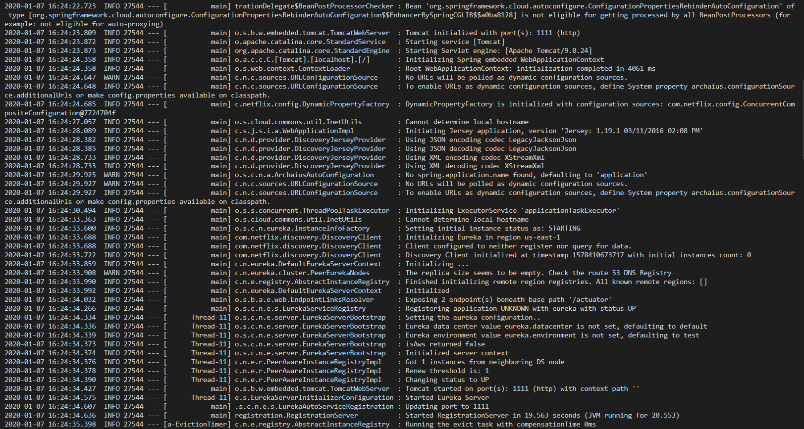
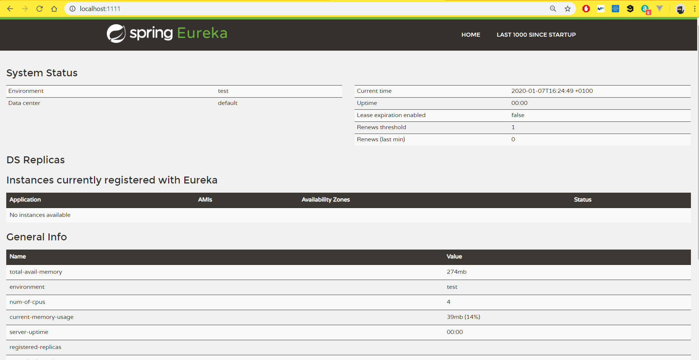
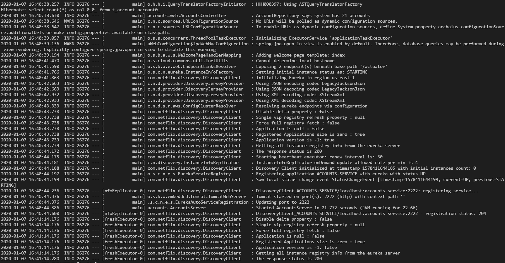
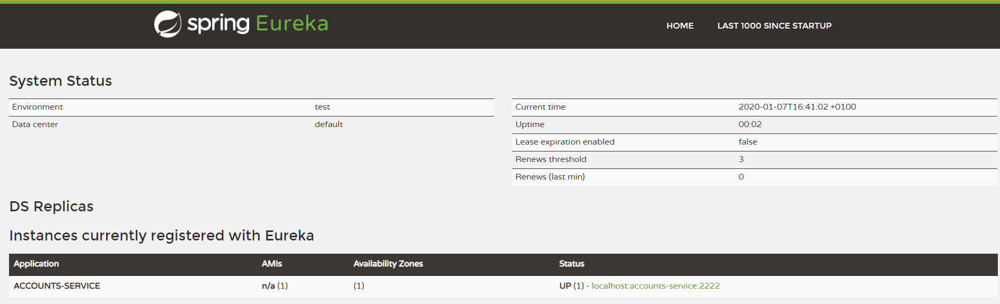
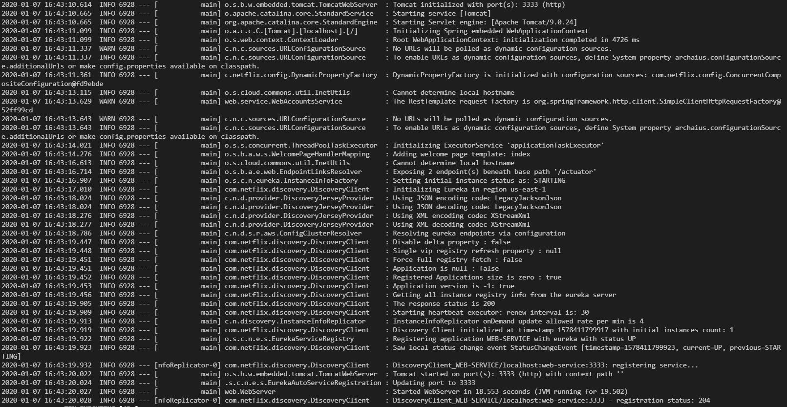
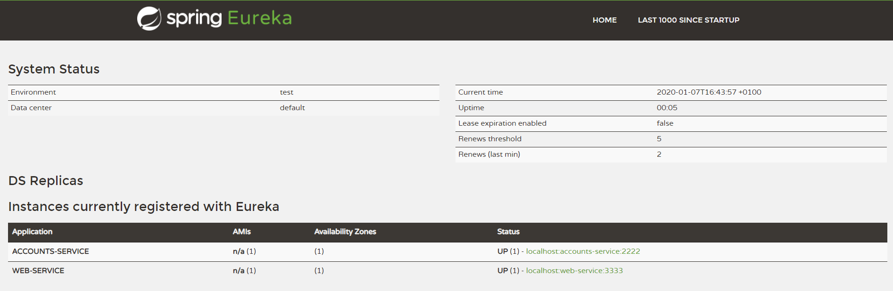
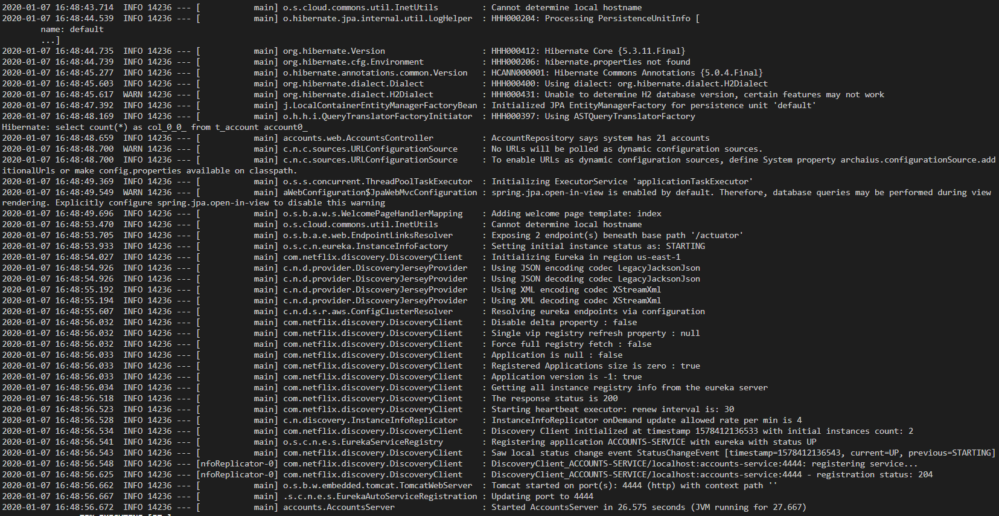
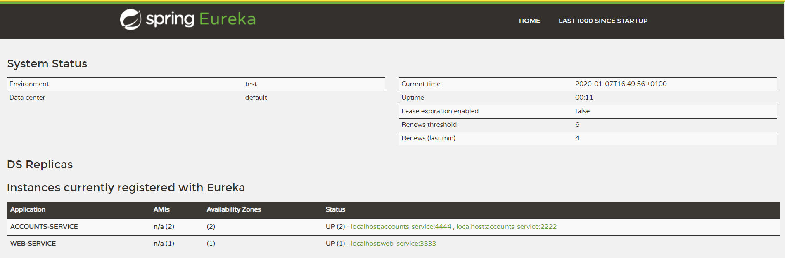
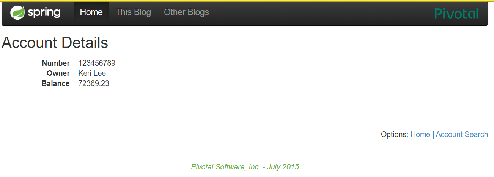

# Lab 6 Microservices: Report

## 1. Registration Server  (Eureka)

* First is launched the registration server Eureka



* The service is running on port 1111 without microservices registered



## 2. Launching Accounts Microservice

* Automatically the service is launched and registered in Eureka



* Eureka logs:

```
2020-01-07 17:12:53.190  INFO 25312 --- [nio-1111-exec-9] c.n.e.registry.AbstractInstanceRegistry  : Registered instance ACCOUNTS-SERVICE/localhost:accounts-service:2222 with status UP (replication=false) 
```

* Eureka dashboard have one service registered



## 3. Launching Web microservice

* Automatically the service is launched and registered in Eureka



* Eureka logs
```
2020-01-07 17:16:01.987  INFO 25312 --- [io-1111-exec-10] c.n.e.registry.AbstractInstanceRegistry  : Registered instance WEB-SERVICE/localhost:web-service:3333 with status UP (replication=false)
```

* Eureka dashboard have now two service registered



## 4. Launch a second accounts microservice on port 4444

In order to launch a new Account microservice on port 4444, the port (2222) in `accounts/resources/application.yml` is changed.

* Launching the second instance of Account:



* Eureka logs

```
2020-01-07 17:16:57.400  INFO 25312 --- [nio-1111-exec-9] c.n.e.registry.AbstractInstanceRegistry  : Registered instance ACCOUNTS-SERVICE/localhost:accounts-service:4444 with status UP (replication=false 
```

* Eureka dashboard have now three service registered



## 4. Killing the accounts microservice on port 2222

After killing the first account microservice, it no longer appears in Eureka's Dashboard, but the web microservice is still able to access the accounts because the microservice in 4444 is a replica

